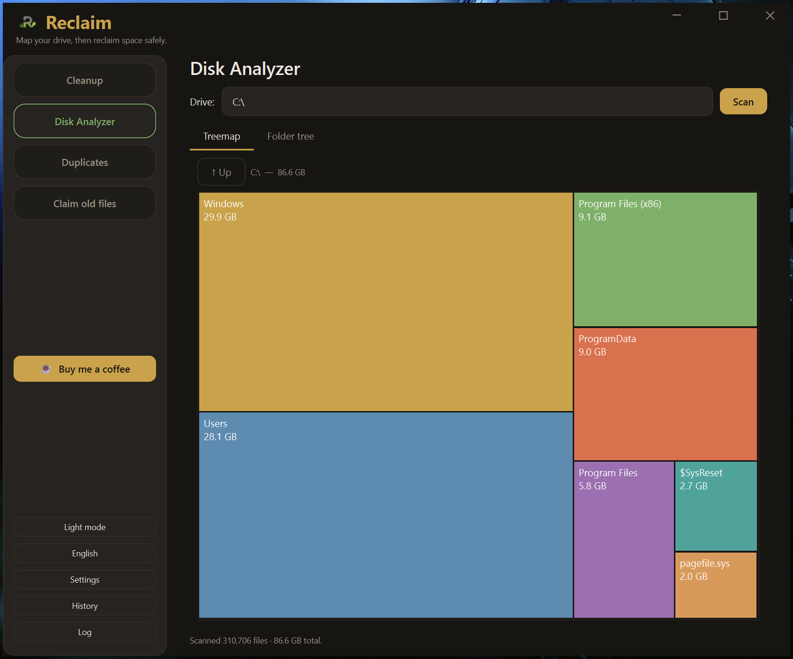
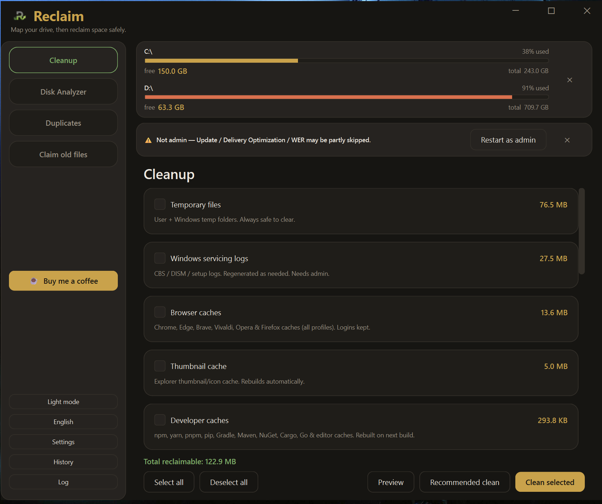
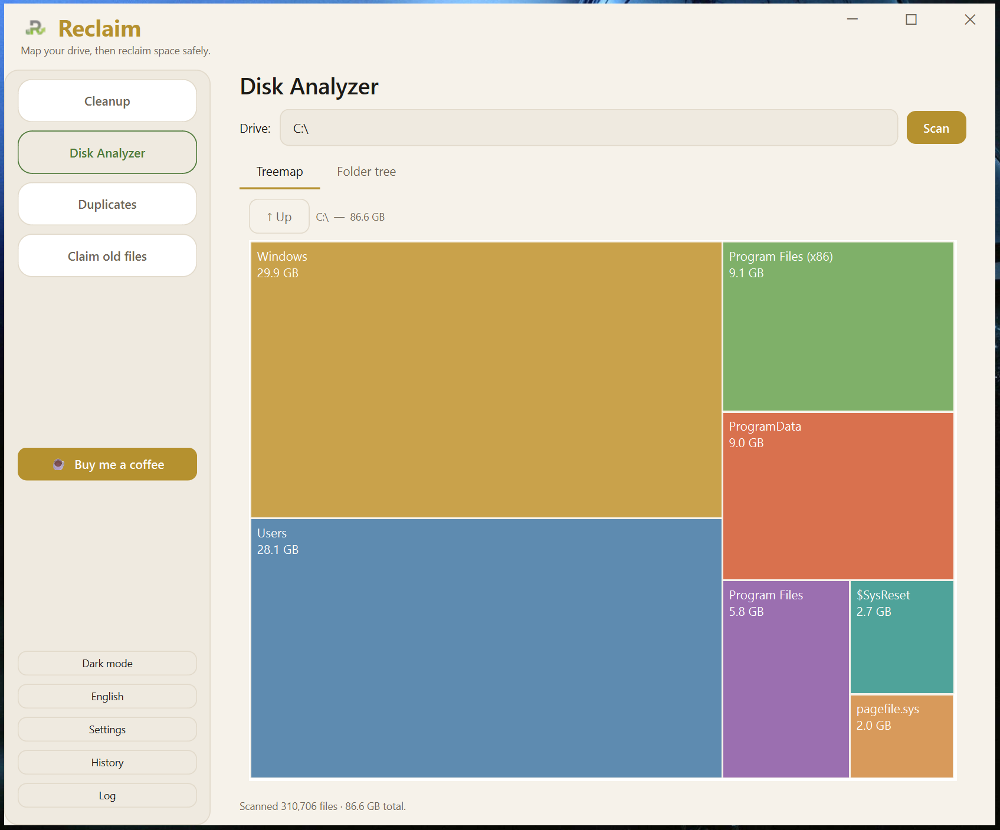
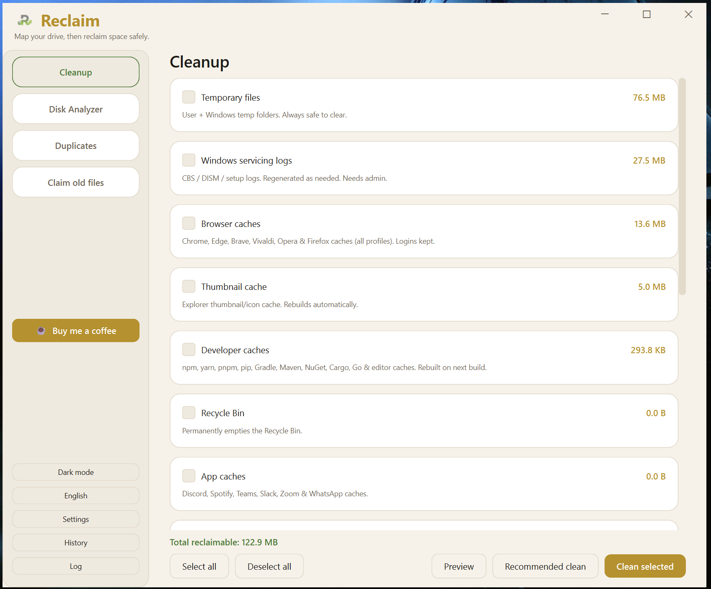

<div align="center">


# Reclaim

**A safe, free, open-source disk-cleanup tool for Windows.**

See what's eating your drive, reclaim space from caches and temp files, and find
duplicate and forgotten files. You never lose anything by accident.

[](https://github.com/OmarSeteen/Reclaim-App/actions/workflows/ci.yml)
[](LICENSE)


[**Download**](#download) · [Features](#features) · [Is it safe?](#is-the-download-safe) · [Build from source](#build-it-yourself) · [Support](#support-the-project)

</div>

---

## Why another cleaner?

Most disk cleaners ask you to *trust* them. Reclaim is built so you don't have to.

- **It deletes only from a short, auditable allowlist** of cache and temp
  locations ([`locations.py`](Reclaim/locations.py)). It never roams your
  drive deciding what to remove.
- **Your personal files survive.** Duplicates and old files go to the **Recycle
  Bin** (undoable) or **move** to another drive (copy first, delete second, so a
  failed move never loses data). Reclaim removes only regenerable caches for good.
- **Windows handles its own system folders.** WinSxS, the hibernation file, and
  `Windows.old` go through Microsoft's own tools (DISM, powercfg). Reclaim never
  deletes inside `System32` or the registry.
- **You preview everything first.** Every cleanup shows the exact files and sizes
  before you commit, and you can cancel any long scan.
- **It's open source.** Read the whole thing here, build it yourself, or check
  that it does what it says.

No ads, no bundled junk, no telemetry, no account.

## Features

🧹 **Cleanup** — whitelisted categories, each with a read-only preview before any
delete: temp files, Recycle Bin, browser caches (Chrome/Edge/Brave/Vivaldi/Opera/
Firefox), app caches (Discord/Spotify/Teams/Slack/Zoom/WhatsApp), **developer
caches** (npm/yarn/pnpm/pip/Gradle/Maven/NuGet/Cargo/Go/editors), Windows Update,
Delivery Optimization, error & crash dumps, servicing logs, thumbnail cache, plus
admin **system reclaim** (WinSxS via DISM, hibernation file, the `Windows.old`
previous install).

📊 **Disk Analyzer** — a whole-drive size map with an interactive **treemap**,
largest files, and a by-file-type breakdown. Run **as administrator on an NTFS
drive** and it reads the Master File Table directly (WizTree-style) for a
near-instant scan.

👯 **Duplicates** — finds byte-identical copies, keeps one, sends the rest to the
Recycle Bin. Hardlink-aware, so it never claims space that deleting wouldn't free.

🗂️ **Old files** — surfaces files you haven't touched in N months. Send them to
the Recycle Bin, or move large ones to another drive to reclaim space without
deleting anything.

🌐 **English & العربية (Arabic)** — the whole UI is translated, with a proper
right-to-left layout. Untranslated strings fall back to English.

🎛️ **Trust & control** — preview before delete, cancellable scans, a one-click
**Recommended clean** of only the fully-safe categories, custom folders to clean,
excluded folders to skip, and a readable history of every cleanup. Settings and
history live under `%LOCALAPPDATA%\Reclaim\`; Reclaim writes nothing else outside
the targets you clean.

## Screenshots

**Disk Analyzer** — a whole-drive treemap. Run as administrator on an NTFS drive
and it reads the Master File Table directly for a near-instant scan.



**Cleanup** — whitelisted categories, each with a read-only preview before any
delete, sorted biggest-reclaimable-first.



A light theme ships alongside the dark one (and the whole UI translates to Arabic
with a right-to-left layout):




## Download

**[➡️ Get the latest release](https://github.com/OmarSeteen/Reclaim-App/releases/latest)**

Download `Reclaim-vX.Y.Z-windows.zip`, unzip it anywhere, and run `Reclaim.exe`.
No installation, no Python needed.

Some categories (Windows Update, crash dumps, component store, hibernation,
`Windows.old`) need administrator rights to clear fully. The app shows a
"Restart as admin" button when it isn't elevated.

### Is the download safe?

The release `.exe` is **not code-signed yet**, so Windows SmartScreen may show a
blue **"Windows protected your PC / unknown publisher"** warning the first time
you run it. New open-source apps without a (paid) signing certificate all hit
this. It is *not* a virus warning.

You can verify it yourself:

- **GitHub Actions builds every release from this public source.** Check the
  build log attached to each release tag.
- Want to skip the warning entirely? **Run from source** instead (below). It's
  Python, nothing more.

To run anyway: click **More info → Run anyway**.

## Run from source

Requires Python 3.9+ and PySide6 (the only runtime dependency):

```bash
pip install -r requirements.txt
python -m Reclaim
```

## Build it yourself

```bash
pip install pyinstaller PySide6
python build.py          # -> dist/Reclaim/  (run Reclaim.exe)
```

The build is a run-in-place folder (`--onedir`) rather than a single `.exe` on
purpose: one-file builds unpack to `%TEMP%` on every launch and leave junk behind
on a crash, the wrong default for a tool that exists to *prevent* that.

## Run the tests

No network and no secrets required:

```bash
python -m unittest discover -s tests -v
```

## How it's built

The architecture enforces the safety guarantee by structure: dependencies flow
one way, and only the UI layer may touch a GUI toolkit, which keeps all the
deletion logic headlessly testable.

```
ui/ + gui  →  cleaners / analyzer / treemap  →  locations / fsutils / winapi / settings / mft / i18n  →  config
```

Full architecture notes, the module map, and the contribution rules live in
[`CLAUDE.md`](CLAUDE.md) and [`CONTRIBUTING.md`](CONTRIBUTING.md).

## Support the project

Reclaim is free and stays free. If it saved you some disk space and you'd like to
say thanks, buy me a coffee:

[](https://ko-fi.com/omarseteen)

You can also help for free: ⭐ **star the repo**, report bugs, suggest cache
locations to add, or contribute a translation.

## Contributing

Contributions are welcome, especially new (safe) cleanup categories and
translations. Read [`CONTRIBUTING.md`](CONTRIBUTING.md) first; the safety
invariant is non-negotiable.

## License

[MIT](LICENSE) © 2026 Omar Seteen
